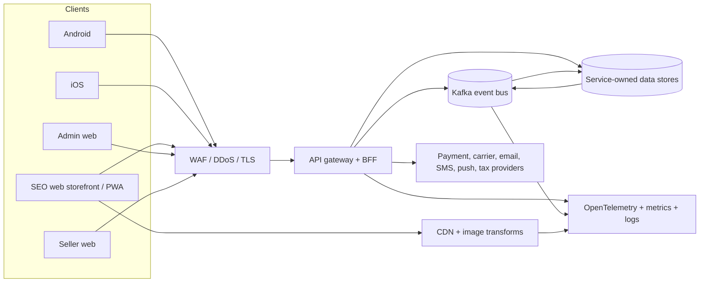
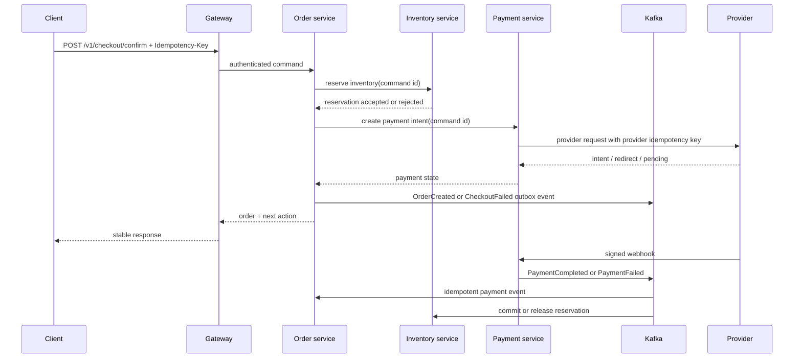
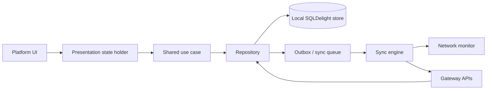
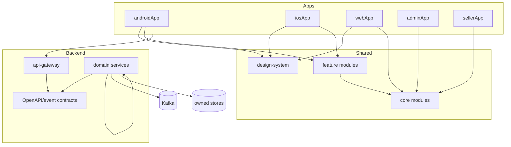

# System Architecture

Status: Phase 1 architecture baseline plus backend and client high-concurrency scaling designs. This document is the source of truth for service boundaries and module direction until an ADR supersedes a decision. Capacity assumptions and upgrade gates are in [docs/SCALABILITY_UPGRADE.md](docs/SCALABILITY_UPGRADE.md) and [docs/FRONTEND_SCALABILITY_UPGRADE.md](docs/FRONTEND_SCALABILITY_UPGRADE.md).

## Goals and non-goals

Goals:

- support customer, admin, and seller workflows across Android, iOS, web, and PWA surfaces;
- keep domain and application logic portable through Kotlin Multiplatform;
- make reads fast and resilient while keeping checkout, payment, inventory, and order state authoritative;
- scale stateless APIs and asynchronous consumers independently;
- provide tenant isolation, auditability, observability, and backward-compatible contracts;
- enable incremental delivery without pretending an unimplemented service is complete.

Non-goals for Phase 1:

- choosing a single payment provider, carrier, cloud vendor, or analytics warehouse;
- implementing all business features in one release;
- making the browser a trusted authority for price, promotion, inventory, or payment state;
- forcing KMP into SEO rendering, browser APIs, or native payment/device APIs where a platform-native solution is safer.

## Quality attributes

The initial service-level objectives are:

| Area | Initial target | Measurement |
| --- | --- | --- |
| Normal read APIs | p95 below 300 ms | gateway and service latency histograms |
| Checkout command | p95 below 500 ms excluding provider processing | end-to-end trace |
| API availability | 99.9% monthly for reads; 99.95% for checkout command path | SLO burn-rate alerts |
| Event delivery | 99.9% of committed events visible to consumers within 60 s | outbox lag and consumer lag |
| Data durability | RPO <= 5 min; RTO <= 30 min for tier-1 services | restore drills |
| Web experience | Core Web Vitals in the “good” range for key templates | real-user monitoring |

These are budgets to validate with load tests and production telemetry, not claims about the empty scaffold.

## System context



The edge terminates public traffic, blocks abusive traffic, applies security headers, and routes to the gateway. Services do not call one another through public URLs. Synchronous service-to-service calls use private mTLS service identities; cross-service workflows use versioned events and a saga where a transaction cannot span stores.

## Request and data flow

### Read path

```text
Client -> CDN/WAF -> Gateway -> service read model/cache -> service database
                                      |
                                      +-> OpenSearch for search queries
```

Public catalog pages may be cached at the CDN when the cache key includes locale, currency, tenant, and catalog version. Authenticated or personalized data is private and never placed in a shared CDN cache.

### Checkout path



The order service owns the order state machine. Payment webhooks are the provider-of-record signal; clients may display a pending state but cannot mark payment complete.

### Offline synchronization



Reads observe local state first. Mutations are classified as safe to queue or online-only. Catalog, wishlist, cart, and order history can be cached; payment authorization, final price calculation, inventory reservation, and checkout confirmation require a live authoritative response. Queue records include a client operation ID, entity version, retry count, and idempotency key. Conflict policy is per aggregate: server-wins for catalog/order state, merge-by-line-item for cart, and last-write-wins only for explicitly low-risk preferences.

## Layered module architecture

```text
Presentation (platform UI, routing, accessibility, view state)
        |
Application (commands, queries, orchestration, policies)
        |
Domain (aggregates, value objects, invariants, state machines)
        |
Data (repository implementations, DTO mapping, local persistence, sync)
        |
Infrastructure (Ktor client, SQLDelight drivers, secure storage, clock, UUID)
```

The domain module imports only Kotlin standard/common APIs and shared error/value abstractions. It must not import Ktor, SQLDelight, Compose, Android, UIKit, browser APIs, or service implementation modules.

## Technology stack

Versions are pinned centrally in the Gradle version catalog and upgraded through dependency review; this document intentionally avoids scattering version numbers across modules.

| Concern | Decision | Reason / trade-off |
| --- | --- | --- |
| Shared language | Kotlin Multiplatform | one implementation for rules, use cases, contracts, sync, and errors; native APIs remain possible |
| Serialization | kotlinx.serialization | compile-time Kotlin models and predictable wire formats |
| Async | kotlinx.coroutines + Flow | structured concurrency and observable local-first state |
| Mobile UI | Jetpack Compose / SwiftUI | platform accessibility, performance, and native integration |
| Storefront UI | Next.js/React with SSR and static rendering | strongest SEO, streaming, accessibility, and web ecosystem; shared KMP is used for portable rules/contracts where practical |
| Admin and seller UI | React/TypeScript web applications | dense operational UI and browser tooling; API contracts are generated and server remains authoritative |
| Backend | Kotlin + Ktor | shared language, lightweight stateless services, explicit middleware and coroutine support |
| API contract | OpenAPI 3.1 + generated clients | contract-first review, compatibility checks, and typed consumers |
| Primary store | PostgreSQL per service | transactions, constraints, mature backup/PITR, and relational commerce data |
| Local client store | SQLDelight | multiplatform schema and type-safe queries; platform drivers are injected |
| Cache / coordination | Redis | bounded TTL cache, rate-limit counters, and short-lived coordination only |
| Search | OpenSearch | catalog indexing, faceting, typo tolerance, and independent read scaling |
| Eventing | Kafka | durable ordered partitions, replay, consumer groups, and event-driven integration |
| Object/media storage | S3-compatible object storage + CDN | durable originals, derived images, and cacheable delivery |
| Migrations | Flyway-compatible SQL migrations | reviewable, ordered, service-owned schema evolution |
| Edge | CDN + WAF + managed ingress | cache, DDoS controls, TLS, and global delivery |
| Observability | OpenTelemetry, Prometheus, Grafana, centralized logs | vendor-neutral traces and operational feedback |
| Deployment | Docker + Kubernetes + Helm + Terraform | repeatable environments and horizontal scaling; managed data services preferred |
| Secrets | cloud secret manager / Vault via workload identity | no secrets in images, source, or client bundles |

## Monorepo module layout

```text
apps/
  androidApp/       Android shell and native integrations
  iosApp/           iOS shell and native integrations
  webApp/           SEO storefront and PWA shell
  adminApp/         admin console
  sellerApp/        seller console

shared/
  core/
    common/         Result, clock, IDs, money, pagination, error primitives
    domain/         cross-feature domain primitives and policies
    data/           repository infrastructure and DTO mapping primitives
    network/        API client ports, auth interceptors, retry policy
    database/       SQLDelight schemas, migrations, cache metadata, sync queue
    sync/           offline operation queue, delta sync, conflict policies
    security/       token/session ports and secure-storage abstractions
    analytics/      typed event names and consent-aware event dispatcher
    localization/   locale, currency, plural, and RTL models
    featureflags/   typed flag evaluation and exposure events
  feature/          vertical slices; each owns domain/application/data/ui contracts
    home/           home feed and merchandising presentation contracts
  design-system/    tokens, component contracts, icons, and accessibility rules

backend/
  api-gateway/      edge BFF, auth context, aggregation, limits, versioning
  identity-service/ identity, sessions, roles, permissions, devices, customer profiles
  category-service/ category tree, hierarchy, SEO metadata
  catalog-service/  products, variants, media references, catalog SEO
  pricing-service/  price books, effective versions, deterministic quotes
  inventory-service stock, warehouses, reservations, availability
  cart-service/     guest/user carts, merges, save-for-later
  order-service/    orders, returns, cancellations, order state machine
  payment-service/  provider adapters, intents, refunds, webhooks, reconciliation
  shipping-service/ rates, shipment, tracking, delivery estimates
  notification-service email, SMS, push, in-app delivery
  promotion-service pricing, coupons, promotions, loyalty
  review-service/   ratings, reviews, moderation
  search-service/   indexing and query API over OpenSearch
  media-service/    uploads, transforms, malware checks, CDN metadata
  cms-service/      landing content, campaigns, banners, SEO content
  analytics-service event ingestion, attribution, reporting exports
  recommendation-service candidate generation and ranking

infrastructure/
  docker/            local dependencies and service image conventions
  kubernetes/        base manifests, policies, and overlays
  terraform/         cloud resources and environment composition
  monitoring/        dashboards, alerts, SLOs, recording rules
  ci-cd/             pipeline, security gates, release automation

docs/                ADRs, diagrams, runbooks, event catalog, decisions
```

## Dependency graph



Allowed direction:

```text
app presentation -> feature application/domain -> core
feature data -> core ports
service adapters -> service domain/application
gateway -> contracts and service client ports
service -> its own database; service -> other services through contracts/events
```

Forbidden direction:

```text
domain -> framework or database
service A -> service B database
client -> database or provider secret
shared feature A -> shared feature B implementation
```

Feature-to-feature collaboration goes through stable domain ports, gateway composition, or versioned events. A shared kernel may contain only genuinely universal value objects; it must not become a dumping ground.

## Service boundaries and ownership

| Service | Owns | Synchronous dependencies | Publishes / consumes |
| --- | --- | --- | --- |
| Identity | identities, sessions, roles, devices, customer profiles | none | UserRegistered; auth context consumed by gateway |
| Category | category tree, SEO metadata, materialized paths | none | CategoryUpdated |
| Catalog | product aggregate, variants, catalog metadata, media references | none | ProductCreated, ProductUpdated, ProductPublished, ProductDeleted |
| Pricing | effective price versions, tax basis points, quote calculation | none | PriceUpdated, PriceDeleted |
| Inventory | stock ledger, warehouse, reservations | catalog SKU validation | InventoryReserved, InventoryReleased |
| Cart | guest/user cart, merge operations | catalog snapshot, promotion quote | CartChanged, CartAbandoned |
| Order | order aggregate, returns, lifecycle | inventory, payment, shipping quote | OrderCreated, OrderStateChanged |
| Payment | intents, provider refs, refunds, webhook evidence | provider adapters | PaymentCompleted, PaymentFailed, RefundCreated |
| Shipping | shipment, rates, tracking | carrier adapters, address validation | OrderShipped, OrderDelivered |
| Promotion | price books, coupons, loyalty ledger | catalog and customer segments | PromotionChanged |
| Search | index and query read model | catalog event stream, pricing event stream | consumes Product*, Price*, Category* |
| Review | review aggregate, moderation | order verification | ReviewPublished |
| Notification | templates, delivery attempts | provider adapters | consumes business events |
| Media | metadata, upload authorization, transforms | S3-compatible object storage/CDN | MediaReady, MediaDeleted |
| CMS | pages, campaigns, banners | media references | ContentPublished |
| Analytics | consented event ingestion and aggregates | event collector | consumes domain events |
| Recommendation | features, candidates, ranking outputs | catalog/search read APIs | consumes behavioral/catalog events |

The gateway may aggregate read responses, but it never owns commerce state. The order service is the workflow coordinator for checkout; payment and inventory retain authority over their own facts.

## Cross-cutting contracts

- Every public request carries `X-Request-Id` and W3C `traceparent`; the gateway creates missing IDs.
- Every command that can be retried accepts `Idempotency-Key` scoped to tenant and authenticated actor.
- Every event has `eventId`, `eventType`, `schemaVersion`, `occurredAt`, `producer`, `tenantId`, `aggregateType`, `aggregateId`, and `correlationId`.
- Money is represented as integer minor units plus ISO-4217 currency; floating point is forbidden for pricing.
- Dates are ISO-8601 instants at the boundary and UTC in storage; locale formatting happens at presentation.
- API errors use a stable machine-readable code, safe message, field violations, request ID, and optional retry metadata.

## Key architectural decisions

### KMP scope

Shared KMP code owns deterministic rules, value objects, use-case ports, DTO/contract models, client error mapping, local persistence abstractions, and synchronization. Native UI, push notifications, biometric APIs, Apple/Google payment SDKs, browser storage APIs, and accessibility integrations remain platform adapters.

### Web rendering

The customer storefront uses SSR/streaming and static rendering for indexable catalog and CMS pages. KMP models and validation can be compiled for web where useful, but the server is still authoritative. This is a deliberate SEO and web-performance trade-off: a pure browser/Wasm UI would maximize UI sharing but complicate crawlers, first render, and ecosystem integrations.

### Event consistency

Services use local ACID transactions plus transactional outbox. A relay publishes committed outbox rows to Kafka. Consumers record inbox/event IDs before side effects. Exactly-once business behavior is achieved through idempotent handlers and unique constraints, not by assuming transport-level exactly-once delivery.

### Read models

OpenSearch and analytics projections are eventually consistent. Product detail and checkout revalidate critical facts with authoritative services. UI labels must expose pending/stale states where a projection can lag.

### Tenant isolation

Tenant ID is mandatory in authenticated context, persistence keys, event envelopes, cache keys, and audit records. PostgreSQL row-level security is a defense-in-depth control for shared service databases; separate databases or clusters are reserved for high-risk tenants or regulated deployments.

### Failure policy

Use bounded exponential backoff with jitter only for transient failures. Do not retry payment capture, order creation, inventory reservation, or webhook processing without an idempotency key and durable state. Circuit breakers and timeouts protect dependencies; dead-letter topics require an owner and replay runbook.

## Phase 2 entry criteria

Before implementing features, the team must approve:

- service ownership table and event naming policy;
- API error, pagination, money, identity, and idempotency conventions;
- tenant model and data residency assumptions;
- payment/currency/tax/country scope;
- SLOs and production environments;
- threat model and data classification;
- first vertical slice: catalog read -> cart -> checkout command -> order status.
