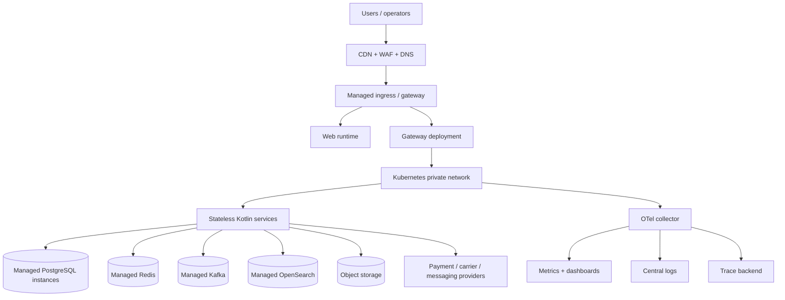

# Deployment Architecture

## Environments

| Environment | Purpose | Data policy |
| --- | --- | --- |
| local | developer feedback with emulators | disposable synthetic data |
| dev | shared integration | non-production secrets and seeded data |
| qa | contract, integration, and E2E | isolated synthetic data |
| staging | production-like rehearsal | masked/synthetic data only |
| production | customer traffic | managed data, approvals, audited changes |

Terraform owns cloud resources. Helm/Kubernetes manifests own service deployment. CI owns build and promotion metadata; no production deploy relies on a developer laptop.

The 200,000-user scaling model, Redis Cluster, Kafka, PgBouncer/read-replica, HPA/KEDA, CDN, WAF, load-testing, and rollback requirements are specified in the [high-concurrency backend upgrade](docs/SCALABILITY_UPGRADE.md). This file describes the common deployment baseline; it does not claim that those runtime components are already implemented.

## Runtime topology



Stateless API and consumer deployments scale horizontally. Stateful systems are managed services where feasible and have a tested replacement/restore path. Workloads have distinct Kubernetes service accounts and least-privilege network policies.

## Kubernetes baseline

Every service deployment must define:

- readiness, liveness, and startup probes;
- CPU/memory requests and limits;
- horizontal autoscaling on utilization plus domain signals such as queue lag;
- PodDisruptionBudget and topology spread constraints;
- non-root, read-only filesystem, dropped Linux capabilities, and seccomp defaults;
- ConfigMaps for non-secret configuration and external secret references for secrets;
- NetworkPolicy restricting egress and ingress;
- graceful shutdown and bounded drain time;
- image digest pinning and signature verification.

Production topology separates public edge, application, worker, and data access concerns. Payment/webhook workloads have dedicated alerting and can scale independently.

Phase 9 adds the executable release contract in [docs/deployment/environment-contract.md](docs/deployment/environment-contract.md), Kustomize overlays under `deploy/k8s/phase9`, release scripts under `ops/release`, and a gated GitHub Actions workflow. Cloud provider/IaC, cluster credentials, external secrets, TLS issuer, and registry settings remain deployment-owner inputs.

## CI/CD pipeline

```text
format/lint -> unit tests -> architecture tests -> SAST/SCA
  -> contract tests -> integration tests -> build/sign images
  -> deploy ephemeral QA -> E2E/smoke -> promote staging
  -> approval + migration checks -> canary production -> smoke
  -> progressive rollout + SLO monitoring
```

Database migrations run as an explicit release step with expand/contract compatibility. Rollback means application rollback plus a forward-compatible migration plan; production schema rollback is not assumed safe.

## Reliability and recovery

- multi-zone deployment for tier-1 workloads;
- autoscaling with admission limits and backpressure;
- queue retry topics and dead-letter topics with replay ownership;
- circuit breakers, timeouts, bulkheads, and provider failover where contracts permit;
- immutable artifact registry and release manifest;
- backup encryption, restore drills, and game days;
- incident severity, escalation, and customer communication runbooks.
