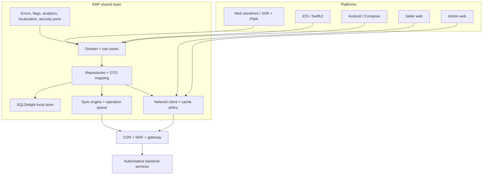
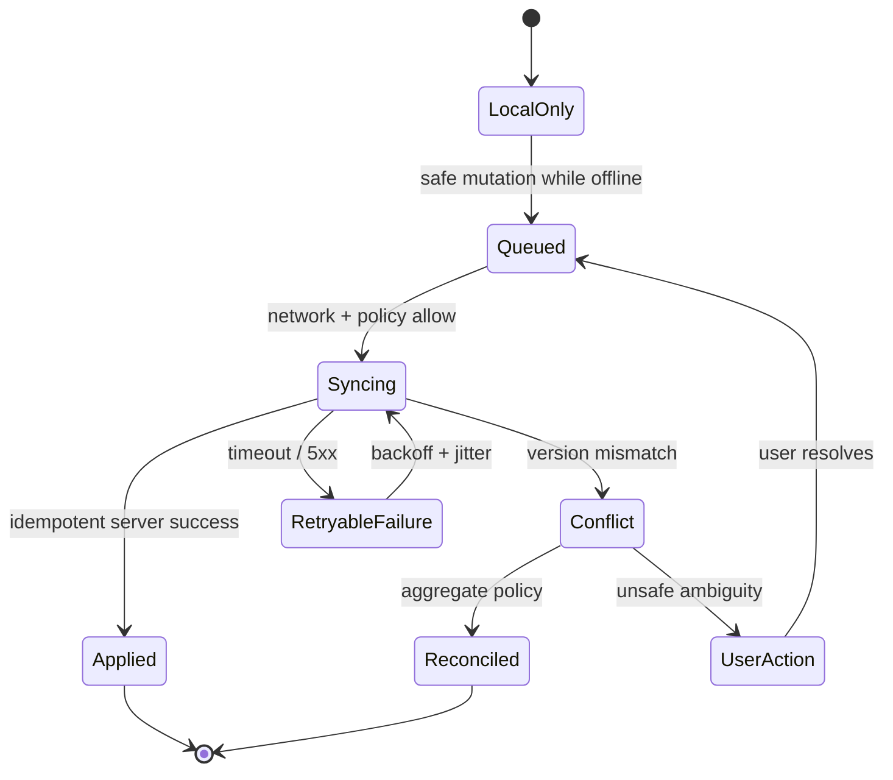

# Frontend and Mobile Scalability Upgrade

Status: client scalability design baseline for the empty application scaffold. No startup, memory, bundle, crash, or network figure below is a production measurement. Initial budgets are guardrails for the first benchmark and must be replaced or ratified with device-, browser-, and network-shaped evidence.

## 1. Current assessment

The repository currently has application directories and shared module placeholders, but no Android, iOS, web, PWA, KMP source, service worker, local database schema, image component, performance test, or crash-reporting configuration. There is therefore no honest baseline for startup time, recomposition, bundle size, cache hit ratio, memory, battery, crash-free users, or API request volume.

The existing architecture already provides the right boundaries: KMP shared policy/data logic, native mobile presentation, SSR web storefront, and a gateway/CDN boundary. This upgrade turns those boundaries into explicit client contracts and a measurement plan. Implementation starts with one vertical slice rather than a broad UI rewrite.

## 2. Client architecture



UI depends on use-case state and stable models, never on HTTP DTOs, database tables, provider SDKs, or backend implementation details. Mobile UIs use Compose and SwiftUI. The SEO storefront uses SSR/streaming and progressive hydration; KMP models and deterministic validation are shared where practical, while browser-specific rendering remains web-native.

## 3. Module and dependency strategy

```text
apps/androidApp/
  app/                 shell, navigation, DI, native services
  core/                Android adapters and platform policies
  design-system/       Compose components and previews
  feature-home/       home presentation
  feature-catalog/     catalog presentation
  feature-search/      search presentation
  feature-cart/        cart presentation
  feature-checkout/    payment and checkout presentation
  feature-orders/      order presentation
  feature-profile/     profile and settings presentation

apps/iosApp/
  App/                 shell, navigation, lifecycle
  Features/            SwiftUI feature adapters
  Platform/            Keychain, push, deep links, background tasks

shared/core/
  common/              IDs, money, clock, results, pagination
  domain/              cross-feature policies and value objects
  data/                repository ports, mapping, cache metadata
  network/             HTTP, auth, retry, ETag, request coalescing
  database/            SQLDelight schema, migrations, local indexes
  sync/                operation queue, delta sync, conflict policies
  analytics/           consent-aware event model and local queue
  security/            secure-storage and token ports
  localization/        locale, currency, plural, RTL models
  featureflags/        typed evaluation and exposure events

shared/feature/<name>/
  domain/ application/ data/   feature-owned vertical slice
```

Allowed direction:

```text
platform presentation -> feature application/domain -> core ports
feature data -> core database/network/sync ports
platform adapters -> expect/actual or injected interfaces
```

Forbidden direction:

```text
domain -> Compose/SwiftUI/React/Android/UIKit/browser/database SDK
UI -> raw HTTP response or SQLDelight query
feature A -> feature B implementation
analytics -> blocking dependency of a user command
```

The shared module is split by responsibility. A single `shared` mega-module is not allowed to become the next bottleneck in build time, ownership, or dependency coupling.

## 4. API and request efficiency

The client uses REST/OpenAPI gateway contracts already defined in [API.md](../API.md). REST plus a gateway aggregation endpoint is the default; GraphQL is not introduced unless profiling demonstrates a material over-fetching problem that cannot be solved with projections and cacheable resources.

Required client/server capabilities:

- cursor pagination with bounded page sizes;
- ETag/`If-None-Match` for cacheable catalog/config responses;
- `Cache-Control` with `stale-while-revalidate` and `stale-if-error` where safe;
- response projections/field selection for list cards versus detail pages;
- request IDs, trace context, and `Idempotency-Key` for mutations;
- delta synchronization using a cursor/change token rather than full database upload;
- compressed JSON and compact DTOs with no duplicated media or unused fields;
- API aggregation for screen-critical data, with a strict fan-out budget;
- explicit online-only commands for payment, inventory reservation, and final checkout.

Client policies:

1. Repository methods expose domain state, not network calls.
2. Identical in-flight reads share one deferred result per cache key.
3. Search input debounces 300 ms and cancels the prior request.
4. Pagination prefetches only one bounded page near the viewport.
5. Screen exit cancels requests that have no other observers.
6. Background refresh is scheduled by freshness, connectivity, battery, and metered-network policy.
7. A failed non-critical refresh preserves the last known safe state and exposes stale metadata.

## 5. Client caching model

```text
UI state / request coalescing
        ↓
bounded in-memory LRU
        ↓
SQLDelight persistent cache
        ↓
HTTP cache / CDN with ETag
        ↓
authoritative API
```

| Data | Client policy | Initial freshness budget |
| --- | --- | ---: |
| categories, brands, locale/config | persistent cache + background refresh | 30 min–24 h |
| product detail/listing | stale-while-revalidate, versioned cache key | 30 s–15 min |
| recommendations | cache per user/tenant/context | 5–15 min |
| search suggestions/recent searches | memory + persistent bounded list | 5–30 min |
| cart/wishlist | local-first with queued mutations and server reconciliation | local immediately; server on reconnect |
| order history | persistent cache, refresh on open and pull-to-refresh | 5–15 min |
| price/inventory/shipping quote | network-first; stale display must be labelled | seconds; never authoritative offline |
| payment state | network-only/status recovery | no offline authority |

Every cache has a size limit, eviction policy, schema version, tenant/locale/currency scope, and clear invalidation owner. Sensitive authenticated data is encrypted or protected by platform storage policy and is never put in a shared CDN cache.

## 6. Stale-while-revalidate and request coalescing

```text
read repository
  -> return fresh local value immediately
  -> if stale, start one background refresh
  -> conditional GET with ETag
  -> update local transaction
  -> emit one state change to observers
```

The coalescing key includes resource, tenant, user scope, locale, currency, query, cursor, and projection. A bounded in-flight map removes entries on success, failure, cancellation, and timeout. It is local to the process; Redis remains the backend stampede control.

Cache fills use TTL jitter and stale-if-error for non-critical catalog data. Price, inventory, checkout, and payment data never use stale values to authorize a financial or stock decision.

## 7. Offline-first and synchronization

The UI observes SQLDelight-backed state. The sync engine owns connectivity, priority, retries, operation status, delta cursors, and conflict resolution.



Operation records include operation ID, aggregate ID, payload version, created time, priority, retry count, next attempt, idempotency key, and last safe error. Sync sends deltas with a cursor/change token and applies responses transactionally; it never uploads the entire local database after reconnect.

| Aggregate | Offline behavior | Conflict rule |
| --- | --- | --- |
| catalog/search | read cached products and local search index | server version wins; refresh projection |
| cart | add/remove/update locally; queue mutation | merge by SKU/line ID; server validates price/stock |
| wishlist | optimistic local mutation | set union with server tombstones |
| order history | cached read-only view | server wins; mark stale |
| profile preferences | queue low-risk edits | field-level merge or last-write-wins |
| checkout/payment | unavailable offline | require live authority; recover status after timeout |

Retries use exponential backoff with jitter and a maximum age. Permanent validation/auth errors move to a user-visible action state. Sync priority is checkout recovery/status, user mutations, order refresh, wishlist/cart reconciliation, catalog delta, then analytics.

## 8. Network resilience

Network policy responds to offline, metered, roaming, battery-saver, and high-latency signals. Every request has a deadline and cancellation path. Retry only idempotent reads or commands with a durable idempotency key. Connection changes do not trigger an unbounded refresh storm.

Network-aware behavior:

- Wi-Fi/unmetered: normal image quality and bounded prefetch;
- metered/roaming: thumbnails, no video prefetch, smaller page sizes;
- high latency: stale cache first, fewer parallel calls, longer user-visible deadline;
- offline: local catalog/cart/wishlist/order view, queued safe mutations;
- battery saver/background: defer non-critical sync and analytics;
- server 429/503: respect `Retry-After`, back off, and show cached/fallback state.

## 9. Media delivery

All media uses object storage plus CDN transforms. Components request a width based on rendered slot and device pixel ratio, never original resolution by default.

```text
card -> 160/320 px thumbnail, AVIF/WebP
listing -> 320/640 px responsive source
detail -> 800/1200 px responsive source
zoom -> explicit high-resolution request
video -> poster first, adaptive stream only after intent
```

Images use `srcset`/`sizes`, lazy loading below the fold, decoding off the critical path, blur/solid placeholders, and bounded memory caches. The media URL includes content hash, transformation parameters, format, and quality so immutable CDN caching is safe. Product video is poster-first, network-aware, muted/autoplay only when appropriate, and never downloaded on mobile data without policy/intent.

## 10. Web and PWA architecture

The web storefront uses SSR/SSG for indexable catalog/CMS routes, streaming where supported, route-level code splitting, selective hydration, and CDN caching of public pages. Admin/seller routes are authenticated and lazy-loaded separately from the storefront.

```text
Home shell -> catalog chunk -> product chunk -> checkout chunk
```

Checkout and payment code are not shipped in the home initial bundle. Hashed assets use long immutable cache lifetimes; HTML and public API responses use short, versioned revalidation.

### Service worker cache classes

| Resource | Strategy | Rules |
| --- | --- | --- |
| hashed static assets | cache-first | versioned cache, cleanup old versions |
| images/media | CDN cache-first | bounded storage, fallback placeholder |
| public product/catalog | stale-while-revalidate | ETag, tenant/locale/version key |
| authenticated app shell | network-first with safe fallback | never leak user data between accounts |
| cart/wishlist | local app store + sync queue | mutations carry idempotency key |
| checkout/payment | network-only | never cache mutation or payment response |
| offline fallback | precached minimal shell | accessible and explains stale state |
```

Cache names are versioned (`static-v1`, `api-v1`, `images-v1`). Activation removes only owned old caches after a successful new worker install. Browser storage has explicit quotas and eviction behavior; unlimited API caching is forbidden.

## 11. Android architecture and performance

Android uses a thin app shell, feature modules, Compose UI, KMP use cases/repositories, SQLDelight storage, WorkManager for constrained background sync, and platform image loading. Release builds use R8/resource shrinking, baseline profiles, startup tracing, and secure signing.

Compose rules:

- immutable/stable UI models and state hoisting;
- `LazyColumn`/`LazyVerticalGrid` with stable keys and bounded paging;
- `remember` and `derivedStateOf` only where profiling shows value;
- no network or expensive computation during composition;
- collect state at the smallest useful scope;
- measure recomposition with layout inspector and macrobenchmarks.

Startup initializes only logging/error boundary, secure session restore, KMP core, and the first route. Analytics, recommendations, non-critical SDKs, and background sync initialize after the first frame. WorkManager jobs are constrained by network and battery state.

## 12. iOS architecture and performance

iOS uses SwiftUI presentation, KMP use cases/repositories, SQLDelight or an approved shared persistence adapter, URLSession through injected network ports, Keychain, BackgroundTasks, and native image caching. SwiftUI state is scoped to feature screens; large lists use lazy containers and stable identity.

Launch work is limited to first-frame dependencies. Background URLSession is reserved for durable transfers such as media/documents, not ordinary API polling. BackgroundTasks perform bounded delta sync subject to system scheduling and user settings. Instruments, XCTest performance tests, memory graph, and MetricKit-style production signals are part of the release gate.

## 13. Local database and memory policy

SQLDelight is the default shared store. Tables are indexed for tenant/user/aggregate, updated time, sync state, and cursor. Writes batch in transactions; queries return bounded pages/flows. Schema migrations are forward-compatible and tested against old app fixtures.

Memory controls:

- bounded LRU memory caches per resource class;
- disk cache quotas and age/size eviction;
- thumbnails in lists; decoded images released when offscreen;
- no unbounded JSON arrays or full-catalog materialization;
- pagination for products/orders/reviews;
- cancellation and lifecycle cleanup for observers and image tasks;
- leak and allocation tests on representative low-memory devices.

## 14. Authentication, tokens, and secure storage

The client stores access/refresh material only through platform secure storage: Android Keystore-backed encrypted storage, iOS Keychain, and secure HttpOnly SameSite cookies for browser sessions where possible. Tokens, credentials, payment data, and PII are excluded from logs and analytics.

An expired access token triggers one refresh operation per session scope. Concurrent callers await the same refresh result. A failed refresh invalidates the session once and redirects to authentication; callers do not create a refresh storm. Web uses CSRF protection for cookie-authenticated mutations. The backend remains the authorization authority.

## 15. Search, listing, and state management

Search input is local-first for recent queries/suggestions, debounced 300 ms, cancellable, minimum-length gated, and cursor-paginated. Query results have a bounded cache key and stale timestamp. Product listings virtualize rows, prefetch one page near the viewport, cache filter metadata, and render skeleton/empty/error/offline states without mounting thousands of components.

State is separated into:

```text
UI state        screen visibility, selection, loading/error presentation
domain state    cart/order/promotion rules and state machines
server state    cacheable API data, freshness, pagination, invalidation
persistent state local SQLDelight data and sync queue
session state   identity, consent, tenant, locale, currency
```

Optimistic updates are allowed for wishlist, safe cart edits, and likes with rollback. They are forbidden for payment, final price, inventory reservation, order confirmation, and refunds.

## 16. Checkout and payment recovery

The client persists a checkout attempt ID and idempotency key before sending the command. If the network fails after a provider request, it does not create a second payment. It queries payment/order status using the existing attempt ID and displays pending/recovery state until the authoritative backend resolves it.

The checkout UI preserves address, shipping selection, and non-sensitive form state locally with expiration. Payment secrets/tokenization remain in provider-controlled flows. Analytics and recommendations never block checkout completion.

## 17. Analytics, push, deep links, and crash resilience

Analytics events enter a consent-aware local queue. Events batch by size/time, compress, retry with a cap, and upload in background; checkout and navigation never await analytics. Sensitive fields are allow-listed and redacted.

Push flow:

```text
backend event -> Kafka -> notification service -> FCM/APNs -> token registration on client
```

Clients register/refresh tokens, handle permission changes, deduplicate notifications, and route deep links. Product/category/promotion/order links support Android App Links, iOS Universal Links, and web fallback. Deep-link handling validates auth and tenant context before navigation.

Crash/ANR monitoring tracks crash-free users/sessions, startup, screen render, memory, network failures, and app version. Fatal logging is non-blocking and redacts tokens, payment data, and PII. A client kill switch can disable recommendations, video autoplay, new checkout, non-critical analytics, or flash-sale UI without a full release where platform rules allow.

## 18. Accessibility and security

All platforms target WCAG 2.2 AA-equivalent behavior: semantic labels, keyboard/focus order, screen-reader announcements, contrast, dynamic type/text scaling, reduced motion, touch target sizing, error association, and accessible offline/stale states. Performance optimizations must not remove semantics or focus management.

Web uses CSP, secure cookies, CSRF protection, trusted-origin CORS, dependency scanning, and no secrets in client bundles. Android/iOS use secure storage, release obfuscation/signing, minimized permissions, sensitive-data masking, and integrity checks only as defense in depth. Certificate pinning is considered only where operational rotation and failure recovery are proven; HTTPS and backend authorization remain mandatory.

## 19. Initial performance budgets

These are initial guardrails for representative devices/networks, not claims about the empty apps. CI fails regressions greater than 10% from the approved baseline even where a target has not yet been finalized.

| Surface | Initial budget | Measurement |
| --- | --- | --- |
| Web LCP | p75 <=2.5 s on mobile 4G | RUM + Lighthouse |
| Web INP | p75 <=200 ms | RUM |
| Web CLS | p75 <=0.10 | RUM |
| Web TTFB | p75 <=800 ms | edge/RUM |
| storefront initial JS | <=200 KB Brotli; checkout route separate | build artifact |
| initial CSS | <=50 KB compressed | build artifact |
| product card image | <=150 KB typical responsive asset | CDN logs |
| listing API page | <=100 KB compressed target | gateway telemetry |
| Android cold start | p95 <=2.5 s on agreed mid-tier device | Macrobenchmark |
| iOS launch to first frame | p95 <=2.5 s on agreed mid-tier device | XCTest/Instruments |
| crash-free sessions | >=99.5% initial release target | crash platform |
| Android ANR | <0.3% initial target | Play/ANR telemetry |
| client analytics batch | <=64 KB compressed | network telemetry |

The benchmark report must include device class, OS, browser, network, locale, cache state, and build version. Targets may be tightened after baseline evidence.

## 20. Performance, load, and failure testing

Web tests cover SSR cache hit/miss, cold browser, repeat navigation, mobile 4G, JavaScript-disabled SEO shell, PWA offline/upgrade, cache eviction, and hydration errors. Lighthouse/WebPageTest and RUM enforce budgets.

Android tests cover cold/warm start, scrolling 1k-item fixture through paging, recomposition, low-memory process death, offline/reconnect sync, WorkManager constraints, Macrobenchmark, and Baseline Profile. iOS tests cover launch, scrolling, memory graph, background task limits, offline/reconnect, dynamic type, VoiceOver labels, and Instruments allocations.

Network tests cover latency, packet loss, captive portal, 2G/3G, metered data, token refresh storms, 429/503, duplicate requests, stale cache, and payment timeout recovery. Backend-facing load scenarios must verify that client caching and request deduplication reduce origin RPS rather than merely shifting work to the gateway.

## 21. Release and compatibility strategy

Web releases use canary traffic and automated rollback based on Core Web Vitals, JS errors, API error rate, and conversion. Android uses internal -> closed -> 5% -> 20% -> 50% -> 100% staged rollout; iOS uses TestFlight and phased release. Both mobile platforms retain backward-compatible API contracts for the supported app window.

Remote configuration controls feature flags, minimum app version, safe cache TTLs, search debounce, page size, maintenance mode, and kill switches. It cannot bypass security safeguards or authorization. Version enforcement supports soft update and force update with a safe offline message.

## 22. Graceful degradation

| Failure | Client behavior |
| --- | --- |
| recommendations unavailable | popular/category products |
| analytics unavailable | queue/drop by consent policy; continue checkout |
| push registration unavailable | app remains usable; in-app order refresh |
| image CDN unavailable | placeholder or cached derivative |
| search unavailable | cached recent results and category browsing |
| stale catalog | show data with stale timestamp and refresh affordance |
| API offline | cached browse/cart/wishlist/order history and queued safe mutations |
| payment timeout | status recovery; never duplicate payment |
| bad remote config | last-known-good signed/configured snapshot |

## 23. Migration plan and rollback

### Stage 0 — Instrument the first vertical slice

Add KMP common/network/database/sync/analytics ports, API request metrics, trace IDs, cache metadata, and test fixtures. Baseline web vitals, startup, memory, cache hit, request counts, and crash reporting. Rollback: disable exporters and keep local behavior unchanged.

### Stage 1 — Catalog read path

Implement SQLDelight product/category cache, ETag/conditional GET, request coalescing, cursor pagination, responsive image URLs, SSR catalog route, and list virtualization. Gate on origin RPS reduction, cache correctness, LCP, memory, and accessibility. Rollback: bypass client cache for an allow-listed route or reduce TTLs without deleting durable state.

### Stage 2 — Auth/cart/wishlist

Implement secure token storage, single-flight refresh, local-first cart/wishlist, idempotent mutation queue, conflict policy, and offline/reconnect tests. Gate on no refresh storm, no duplicate mutation, and deterministic reconciliation. Rollback: disable offline mutation queue behind a flag while retaining read cache.

### Stage 3 — Web/PWA and media

Add service worker versioning, cache migration, offline shell, CDN image transformation, route-level code splitting, and video policy. Gate on Lighthouse/RUM, cache isolation, storage quota, and service-worker upgrade tests. Rollback: serve previous worker/static manifest and disable runtime API caching.

### Stage 4 — Checkout recovery and notifications

Add durable checkout attempt state, status recovery, push/deep-link handling, analytics batching, and kill switches. Gate on duplicate-payment simulations, background constraints, privacy review, and crash-free metrics. Rollback: disable new checkout UI and route to compatible flow; never retry payment blindly.

### Stage 5 — Mobile hardening

Add Baseline Profiles/Macrobenchmarks, iOS launch/memory tests, R8/signing, background sync constraints, low-memory handling, and staged release automation. Gate on performance budgets and staged telemetry. Rollback: halt rollout and remotely disable non-critical features.

### Stage 6 — Scale validation

Run 2 lakh connection/user-journey profiles against the backend capacity harness, comparing cache-on versus cache-bypass origin load, bandwidth, mobile battery, and error budgets. Publish measured budgets by platform and device. Multi-million scale is accepted only when client origin traffic, storage growth, and failure behavior remain within the backend plan.

Every stage includes implementation, configuration, monitoring, unit/integration/UI/E2E/performance tests, failure tests, rollback instructions, and documentation updates.

