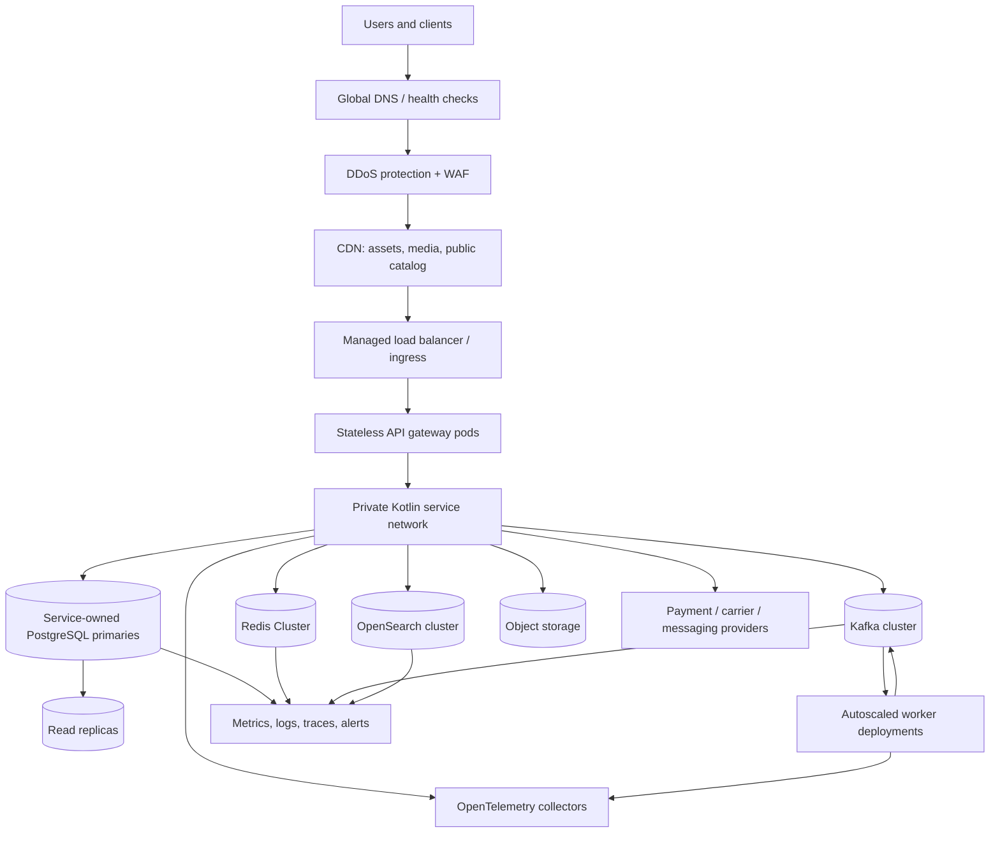

# High-Concurrency Backend Upgrade

Status: scalability design baseline for the empty backend scaffold. No throughput or latency result in this document is a production measurement. Values marked as estimates are workload assumptions used to size the first benchmark and must be replaced with test results before production capacity is approved.

## 1. Current architecture assessment

The repository currently contains architecture documentation and service boundaries, but no Kotlin service source, database migrations, Kubernetes manifests, Terraform modules, Redis configuration, Kafka configuration, or load-test scenarios. Therefore:

- there is no current bottleneck measurement;
- there is no safe basis for increasing pod counts or database sizes;
- the existing architecture already names the required scaling primitives, but they are not implemented;
- the first engineering step is an observable vertical slice plus a repeatable benchmark harness.

The upgrade preserves the existing service ownership model and adds explicit capacity, caching, queueing, connection, autoscaling, and failure budgets.

## 2. Capacity model and assumptions

“2 lakh users” is not an RPS number. The design floor below models 200,000 daily active users and a more demanding flash-sale burst. It is intentionally conservative enough to exercise horizontal scaling without claiming that all users issue requests simultaneously.

| Metric | Baseline model | Flash-sale design point | How to validate |
| --- | ---: | ---: | --- |
| Daily active users | 200,000 | 200,000+ | analytics, consent-aware |
| Sessions/user/day | 3 | campaign burst concentrated in 15 min | client telemetry |
| Dynamic API calls/session | 30 | 15 calls/user/5 min for 100,000 active users | journey load test |
| Average daily API RPS | ~208 | — | `200k * 3 * 30 / 86,400` |
| Campaign peak before burst factor | — | 5,000 RPS | `100k * 15 / 300` |
| Origin RPS design budget | — | 12,500 RPS | 2x burst × 25% headroom |
| Stress-test target | — | 25,000 RPS | sustain 15 min, then ramp to failure |
| Request-active clients | — | 100,000 | load generator and gateway metrics |
| Client connections | — | 200,000 | HTTP/2/keep-alive connection test |
| Static/media edge RPS | — | 20,000 | CDN access logs; origin should be a small fraction |

### Workload split at 12,500 origin RPS

| Workload | Share | Design RPS | Consistency |
| --- | ---: | ---: | --- |
| catalog/product/listing | 40% | 5,000 | cache/read replica acceptable |
| search | 16% | 2,000 | OpenSearch projection |
| cart/wishlist/profile | 12% | 1,500 | user-scoped; writes authoritative |
| auth/session | 8% | 1,000 | auth store/Redis; strict limits |
| checkout/order/payment | 4% | 500 | primary/transactional only |
| admin/seller APIs | 4% | 500 | tenant-scoped, lower burst budget |
| CMS/config/other | 16% | 2,000 | CDN/cache/read replica |

Checkout is only 4% of traffic in this model but consumes the strictest consistency and provider budgets. It must never be allowed to consume the connection pool or worker capacity reserved for browsing.

### Capacity budgets

| Resource | Initial budget | Sizing rule |
| --- | ---: | --- |
| Database round trips | <=0.5 average per cacheable origin request; 8–15 per checkout command | measure by service; cache misses and checkout are separate budgets |
| Redis hit ratio | catalog/listings >=95%; configuration >=99%; cart/session >=85%; overall >=90% | alert on 10-minute degradation, not one noisy minute |
| Kafka events | ~2,500 events/s peak at 2 KB average | 5 MB/s payload; RF 3 implies ~15 MB/s broker replication before headroom |
| Event queue depth | <75,000 messages for normal peak; page at 150,000 | 30 s and 60 s of peak event rate respectively |
| API network | ~100 MB/s responses + ~25 MB/s requests at design RPS | 10 Gbps edge/internal capacity with burst headroom |
| Kafka hot retention | ~7.2 GB/day average raw event payload in this model | 7-day hot retention, RF3, overhead included: provision ~300 GB minimum per event domain cluster |
| Operational database growth | estimate 5–20 GB/day across all services including indexes | benchmark writes; archive by retention class; retain free space >=30% |
| Search storage | source projection plus 2–4x index/shard/replica overhead | snapshot and restore test before increasing replicas |
| Media storage | 100–300 GB/month initial planning range | object storage lifecycle rules; CDN handles delivery |

These budgets are starting hypotheses. A release cannot use them as an SLO until k6/Gatling scenarios, production-like data, and failure tests replace the estimates with measured p50/p95/p99, saturation, and cost results.

### Initial per-service benchmark envelope

| Service/workload | Benchmark envelope | First scaling signal |
| --- | ---: | --- |
| gateway | 12,500 RPS aggregate with p95 <300 ms | RPS per pod, active connections, p95 |
| catalog | 5,000 RPS with >=95% cache hit | RPS, cache miss rate, DB wait |
| search | 2,000 query RPS with p95 <300 ms | query latency, CPU, shard queue |
| cart/wishlist | 1,500 RPS with conflict rate <1% | RPS, DB pool wait, optimistic conflicts |
| checkout/order | 500 commands/s without oversell or duplicate payment | command latency, pool wait, provider latency |
| event workers | 2,500 events/s with lag <30 s | consumer lag and processing duration |

Pod counts, instance types, and replica counts are deliberately not declared as facts until this envelope is measured. HPA uses a maximum-in-flight and latency budget, not CPU alone.

## 3. Target high-concurrency topology



The public path is CDN/WAF -> load balancer -> gateway -> private services. Databases, Kafka, Redis, and OpenSearch are private. API and worker pods are stateless; durable state is in service-owned stores and event logs.

## 4. Redis architecture

### Usage policy

Redis is cache, coordination, rate limiting, and bounded session material. It is never the source of truth for orders, payments, inventory, or price decisions.

| Key family | Example | TTL | Invalidation |
| --- | --- | ---: | --- |
| product detail | `catalog:{tenant}:product:{id}:v{catalogVersion}` | 5–15 min | ProductUpdated / versioned key |
| product listing | `catalog:{tenant}:listing:{hash}:v{catalogVersion}` | 30–120 s | catalog version bump |
| category/brand | `catalog:{tenant}:taxonomy:{id}:v{version}` | 15–60 min | publication event |
| safe price quote | `price:{tenant}:{sku}:{currency}:{version}` | <=60 s | price version event |
| store config | `config:{tenant}:{locale}:{version}` | 5–30 min | config publication |
| feature flag | `flags:{tenant}:{subject}:{version}` | 30–300 s | flag version bump |
| rate limit | `rl:{scope}:{route}:{window}` | window length | atomic Lua/token bucket |
| stampede lock | `lock:cache:{key}` | <=10 s | expiry only; no manual dependency |
| session material | `session:{sessionId}` | short, policy-defined | logout/revocation |

Cache-aside flow:

```text
read -> local/request cache -> Redis -> read replica/primary -> Redis with TTL -> response
write -> authoritative DB transaction -> outbox invalidation/version event -> Redis delete/version bump
```

Cache keys include tenant, locale, currency, authorization scope, and schema/catalog version where relevant. Never cache a response whose authorization or price context is not part of the key.

### Cluster and operational controls

Production uses managed Redis Cluster or an equivalent sharded, replicated deployment with automatic failover, multi-zone placement, TLS, ACLs, and topology-aware clients. The client uses a single long-lived pool and cluster discovery; it does not open a connection per request.

Required metrics: hit/miss ratio by key family, p50/p95/p99 latency, memory, evictions, fragmentation, CPU, connections, blocked clients, replication lag, failover count, and hot-key distribution.

### Stampede and hot-key protection

- request coalescing within a pod for identical in-flight reads;
- short-lived Redis lock only on cache fill, with token-checked release and bounded expiry;
- stale-while-revalidate for non-critical catalog/config data;
- TTL jitter of 10–20% to avoid synchronized expiry;
- negative caching for safe not-found results with a short TTL;
- CDN caching for public product pages and media;
- hot-key dashboard and per-key request sampling;
- rate limits and admission control for flash-sale endpoints.

Distributed locking is not used for every read and is never the only inventory correctness mechanism.

## 5. Kafka architecture

Kafka is used for durable asynchronous work, not as a synchronous RPC transport. Checkout waits only for authoritative inventory/payment/order transitions required to answer the command; notifications, analytics, indexing, recommendations, invoices, and reporting are asynchronous.

### Production baseline

- minimum three brokers across availability zones;
- replication factor 3, `min.insync.replicas=2`, producer `acks=all`;
- idempotent producers and bounded retries;
- compression enabled, with batch/linger tuned by benchmark;
- topic-level retention and compaction selected by event semantics;
- schema registry with backward-compatible version checks;
- partition key preserves aggregate ordering, normally `tenantId + aggregateId`;
- consumer groups per independent projection/workflow;
- retry topics with bounded attempts and delayed redelivery;
- dead-letter topics with owner, alert, replay tool, and retention policy.

### Initial topic plan

| Topic | Key | Initial partitions | Consumers |
| --- | --- | ---: | --- |
| `catalog.product.v1` | tenant + product | 24 | search, recommendation, analytics |
| `inventory.stock.v1` | tenant + SKU | 24 | catalog availability, analytics |
| `commerce.order.v1` | tenant + order | 24 | payment, inventory, notification, analytics |
| `commerce.payment.v1` | tenant + payment | 24 | order, inventory, notification, analytics |
| `commerce.cart.v1` | tenant + cart | 12 | analytics, abandonment |
| `commerce.notification.v1` | tenant + notification | 12 | email/SMS/push workers |
| `commerce.audit.v1` | tenant + subject | 12 | audit archive, security analytics |
| `commerce.retry.*` | original key | matched | retry consumers |
| `commerce.dlq.*` | original key | matched | operator-controlled replay |

Partitions are an initial envelope, not a permanent number. Increasing partitions can change ordering and key distribution; make the partition count and consumer throughput part of an ADR before changing a hot topic.

### Kafka failure behavior

The outbox relay retries publish failures. Consumers commit offsets only after the inbox record and business side effect are durable. A poison message moves to a retry topic, then DLQ; it never blocks a partition indefinitely. Monitor consumer lag, under-replicated partitions, ISR, broker disk/CPU/network, producer error rate, request latency, rebalance rate, and outbox age.

## 6. Database scaling

Each service retains a separate ownership boundary. PostgreSQL write paths use the primary; cacheable and stale-tolerant reads use read replicas or projections. Payment, inventory reservation, order creation, and post-write confirmation reads remain on the primary or use an explicit read-your-writes mechanism.

```text
service -> HikariCP -> PgBouncer transaction pool -> primary
                                          |
                                          +-> read pool -> replica(s)
```

Controls:

- HikariCP pool sizes are derived from measured DB capacity, not pod count; start with a small pool per pod and cap aggregate connections at the database budget;
- PgBouncer transaction pooling protects PostgreSQL from pod churn;
- statement and lock timeouts prevent runaway work;
- slow query logs, `pg_stat_statements`, query-plan review, and index usage are mandatory;
- read replicas scale read-heavy catalog/search-adjacent projections;
- partition only measured high-volume tables such as audit/events by tenant/time where query plans justify it;
- use bounded pagination and keyset/cursor queries; never offset-scan large mutable tables;
- autovacuum, bloat, replication lag, and pool wait are capacity signals;
- migrations use expand/migrate/contract and never require all pods to stop.

Suggested starting limits for a benchmark environment, to be tuned rather than copied to production:

```text
per-pod application DB pool: 5–15 connections
per-service aggregate connection budget: explicitly reserved
statement timeout: route-specific, normally <2 s for reads
checkout lock timeout: short and surfaced as retryable contention
replica lag alert: route-specific; consistency-sensitive reads bypass replicas
```

## 7. CDN and object storage

CDN-cache immutable media, versioned JavaScript/CSS/fonts, public catalog pages, and explicitly safe catalog responses. Cache keys vary by locale, currency, tenant, catalog version, and device image variant. Authenticated/personalized responses use private or no-store caching.

Media uploads use presigned URLs to S3-compatible object storage. Application servers receive metadata, not file bytes. A media worker validates type and malware status, creates WebP/AVIF/responsive derivatives, and publishes `MediaProcessed`. Object versioning, lifecycle transitions, encryption, access policies, and cross-region replication are enabled according to data classification.

## 8. Load balancing, gateway, and rate limiting

The gateway is stateless and horizontally scaled behind a managed load balancer. It performs route validation, auth context, CORS/security headers, request IDs, API versioning, quotas, and safe read aggregation. It must not become the owner of order, payment, inventory, or catalog state.

Redis-backed token-bucket or sliding-window limits are keyed by route class and identity:

| Route class | Initial policy to benchmark |
| --- | --- |
| login/password reset | 100/min/IP plus identity risk controls |
| search | 300/min/user, lower anonymous/IP quota |
| catalog reads | high burst, protected by CDN/cache and bot controls |
| cart mutation | 120/min/user |
| checkout confirm | 10/min/user and one in-flight command/user |
| payment/webhook | provider-specific signature and replay controls |
| admin/seller mutation | tenant/user quotas and audit |

Limits return `429` with `Retry-After`; critical routes have a reserved capacity pool so catalog floods do not starve checkout. WAF/bot controls execute before application rate limiting.

## 9. Search scaling

Catalog changes commit to the catalog database and outbox; the search index is updated asynchronously in bulk. The OpenSearch cluster starts multi-zone with dedicated cluster-manager nodes, data nodes, replicas, shard sizing from measured index volume, refresh interval tuned for the business latency requirement, and snapshots to object storage.

Search is read-only from the client perspective. Query timeouts, result-size caps, allow-listed filters, circuit breakers, query caches, and fallback category browsing prevent a search outage from taking down the storefront. Bulk indexing and replay are isolated from user query capacity.

## 10. Workers and asynchronous processing

Separate deployments and consumer groups handle notification, email, SMS, push, invoice, search index, analytics, recommendation, media, and abandoned-cart work. Workers are idempotent, bounded, horizontally scalable, and use provider-specific concurrency limits. Each has retry/backoff, DLQ, metrics, and a replay runbook.

Non-critical failures degrade safely:

| Dependency | Customer behavior |
| --- | --- |
| recommendations | show popular/category products |
| analytics | buffer/drop according to consent and policy; checkout continues |
| notifications | order succeeds; delivery retries asynchronously |
| search | category/curated browsing fallback |
| media transforms | serve prior derivative/original or placeholder |
| carrier quote | configured fallback method or explicit unavailable state |

## 11. Flash-sale and inventory protection

Product views use CDN/Redis and never decrement stock. Checkout calls inventory, which owns an atomic reservation transaction with TTL, idempotency key, per-SKU contention controls, and a durable stock ledger. Hot SKUs receive admission control and bounded reservation concurrency. Redis may expose an approximate availability view, but the primary inventory transaction decides.

The order/payment saga is:

```text
create pending order -> reserve inventory -> create payment intent
payment success -> confirm order -> commit reservation
payment failure/expiry -> release reservation -> cancel pending order
```

Compensations are idempotent and observable. No distributed database transaction or unbounded distributed lock is used.

## 12. Connection and response management

- long-lived HTTP, Redis, Kafka, and provider pools are created at application startup and closed during graceful shutdown;
- pool acquisition has a timeout and metric;
- every provider call has a deadline, circuit breaker, bulkhead, and bounded retry policy;
- HTTP compression, HTTP/2 or HTTP/3 at the edge, ETags, conditional GET, field selection, and cursor pagination reduce origin work;
- response payloads are capped and never return unbounded product/order collections;
- gateway and service shutdown drains requests before pod termination.

## 13. Resilience and failure handling

Default policies are route-specific:

- timeout: shorter than the caller deadline and never unlimited;
- retry: only transient failures, exponential backoff with jitter, bounded attempts;
- circuit breaker: open on sustained dependency failures and recover through half-open probes;
- bulkhead: separate pools for browsing, checkout, webhooks, and workers;
- backpressure: bounded queues and `429`/`503` with retry metadata;
- graceful degradation: explicit fallback for every non-critical dependency;
- idempotency: required before retrying financial, inventory, or order commands.

## 14. Security and network controls

Public traffic enters through DDoS protection, WAF, CDN, and load balancer. Services, Redis, Kafka, OpenSearch, and databases live in private subnets. NetworkPolicy/security groups allow only required flows. TLS/mTLS, OIDC, rotating tokens, secrets manager/workload identity, encryption at rest, RBAC, dependency/SAST/container/DAST scans, signed webhooks, and audit logs follow [SECURITY.md](../SECURITY.md).

## 15. Observability and tracing

Every request and event carries request/trace/correlation/causation identifiers. RED metrics are required for every API and worker. The scalability dashboards must add:

- gateway active connections, RPS, p95/p99, 4xx/5xx, rate-limit rejects;
- per-service pool wait, queue wait, timeout, circuit state, and fallback count;
- PostgreSQL pool usage, locks, slow queries, replica lag, bloat, and WAL rate;
- Redis hit ratio, evictions, hot keys, latency, blocked clients, failovers;
- Kafka producer errors, throughput, consumer lag, rebalance, ISR, and DLQ rate;
- OpenSearch query latency, rejected tasks, shard health, refresh/indexing lag;
- business signals: checkout conversion, reservation failures, duplicate suppression, payment webhook lag.

Tracing is sampled for ordinary reads but retains all checkout, payment, inventory, error, and slow traces. Logs are structured JSON and redact credentials, tokens, PAN/CVV, and unnecessary PII.

## 16. Disaster recovery and multi-region readiness

Initial production target: RPO <=5 minutes and RTO <=30 minutes for tier-1 order/payment/inventory data, subject to restore drills and provider contracts. Backups are encrypted, PITR-enabled, cross-region copied, and restore-tested. Object storage is versioned. Kafka has multi-zone replication and replayable retention. Redis/OpenSearch are rebuildable unless a service-specific exception is approved.

Start with one multi-zone region if cost or operational maturity requires it. Keep global DNS, stateless services, tenant-aware keys, event versioning, object replication, and explicit data residency boundaries so a second region can be added later. Active/passive is the default for order/payment state until conflict and payment settlement semantics justify active/active.

## 17. Autoscaling

HPA/KEDA policies use multiple signals with scale limits and stabilization windows:

```text
API: CPU + RPS/pod + active connections + p95 latency
Workers: CPU + Kafka lag + oldest-message age
Search: query latency + rejected tasks + CPU/disk watermarks
Nodes: pending pods + resource pressure
```

Every workload has minimum pods for zone spread, maximum pods for downstream protection, readiness gates, startup/liveness probes, PDB, resource requests/limits, and graceful termination. Scaling workers faster than the provider/database budget is a failure mode; concurrency is capped at the dependency boundary.

## 18. Performance, stress, and failure testing

The first benchmark suite uses production-shaped fixtures and scenarios, not one hot endpoint:

1. browse catalog and product detail with 95% cache hit;
2. search with common and adversarial queries;
3. login/session refresh;
4. cart reads and mutations with conflicts;
5. checkout with inventory contention and fake payment provider;
6. webhook completion/replay;
7. order tracking;
8. flash-sale hot SKU;
9. admin/seller bulk operations;
10. provider, Redis, Kafka, replica, OpenSearch, and notification failures.

Run 10k, 25k, 50k, 100k, and 200k concurrent-connection profiles where the load tool and environment can support them. Ramp to 25k origin RPS, sustain, then continue until a controlled bottleneck appears. Record maximum sustainable RPS, p50/p95/p99, error rate, pool wait, cache hit ratio, Kafka lag, DB CPU/IOPS, search saturation, and cost per million requests.

No result passes until data correctness is checked: no duplicate orders, no oversell, no lost outbox event, no double refund, and no cross-tenant response.

## 19. Cost optimization

- maximize CDN and Redis hit ratios before adding application pods;
- use read replicas/projections rather than over-sizing primaries;
- provision Kafka partitions from measured throughput and retain only what replay/operations require;
- use managed Redis/Kafka/PostgreSQL/OpenSearch where the operational reduction justifies the premium;
- scale workers from lag and age, not idle CPU;
- sample ordinary traces and retain business-critical traces;
- apply object lifecycle tiers and media derivatives;
- use spot/preemptible capacity only for replayable workers;
- enforce per-tenant quotas, request budgets, and log cardinality limits;
- review cost per checkout and cost per million cache-miss requests after every load test.

## 20. Migration plan, gates, and rollback

### Stage 0 — Baseline and instrumentation

Add request metrics/traces, pool metrics, cache/event correlation IDs, query timing, and synthetic smoke tests to the first catalog/cart/checkout slice. Establish the current baseline. Rollback: disable new telemetry exporters or sampling configuration; application behavior is unchanged.

### Stage 1 — Externalize state and edge protection

Deploy CDN/WAF/load balancer, object storage for media, stateless gateway sessions, distributed rate limits, and safe cache-aside reads. Gate on cache correctness, tenant isolation, origin error rate, and cache hit ratio. Rollback: reduce TTLs, bypass cache for an allow-listed route, or route to the previous origin; never delete authoritative data.

### Stage 2 — Database protection

Add PgBouncer, bounded pools, query timeouts, indexes, read replicas for tolerant reads, and migration checks. Gate on pool wait, replica lag, query p95/p99, and write correctness. Rollback: route affected reads to primary, reduce pod max, or disable the replica route; preserve schema compatibility.

### Stage 3 — Outbox and Kafka workers

Implement transactional outbox/inbox, event schemas, relay, retry/DLQ, and one worker at a time (search/notification/analytics). Gate on outbox age, consumer lag, duplicate suppression, and replay drills. Rollback: pause the new consumer, keep outbox rows, and replay after repair; do not discard events.

### Stage 4 — Resilience and autoscaling

Add timeouts, circuit breakers, bulkheads, KEDA/HPA, PDBs, and graceful degradation. Gate on fault-injection tests and controlled recovery. Rollback: freeze autoscaler max, disable a fallback/flag, or revert the deployment while retaining compatible contracts.

### Stage 5 — Flash-sale and payment hardening

Add hot-key/request coalescing, inventory reservation controls, checkout concurrency limits, provider idempotency/reconciliation, and webhook replay tooling. Gate on no oversell/duplicates under contention and payment reconciliation. Rollback: close or throttle the sale, disable a provider via feature flag, and route to a safe pending state.

### Stage 6 — Production capacity and multi-region readiness

Run 25k+ RPS, connection, chaos, restore, and canary tests; publish measured capacity and cost. Promote only after SLOs, security, DR, and operational ownership are signed off. Multi-region is an explicit later change, not an assumption hidden in the first deployment.

Each stage must include implementation, configuration, monitoring, unit/integration/load/failure tests, rollback procedure, and updated runbook before the next stage begins.

## Technology choices

The existing stack remains appropriate: Kotlin/Ktor services, PostgreSQL with PgBouncer, Redis Cluster, Kafka, OpenSearch, S3-compatible storage, CDN/WAF, Docker/Kubernetes/Helm/Terraform, OpenTelemetry/Prometheus/Grafana, and k6/Gatling. A managed offering is preferred when it materially reduces operational risk. No technology is introduced solely because it is fashionable.

